# PaDiM-EfficientNet

There are two differences from the existing [PaDiM code](https://github.com/xiahaifeng1995/PaDiM-Anomaly-Detection-Localization-master). 

1. used the transfer-learned EfficientNet model, and utilized the beginning, middle, and end of feature maps of each block (Here, it is expressed in Fst, Md, Lst)
2. The test code of the existing code takes a long time by calculating the distance of Mahalanobis based on scipy, which is replaced by a tensor (attach GPU) base to reduce the inference time.

## Requirement
* pytorch=1.8.0=py3.7_cuda11.1_cudnn8.0.5_0 (Or something similar)

* [EfficientNet-PyTorch](https://github.com/lukemelas/EfficientNet-PyTorch)

  The test equipment is a single rtx3090 and see the `environment.yaml` or `requirements.txt` file for detailed environment settings.

## Datasets
MVTec AD datasets : Download from [MVTec website](https://www.mvtec.com/company/research/datasets/mvtec-ad/)

## Results
### Implementation results on MVTec
* Image-level anomaly detection accuracy (ROCAUC)

|MvTec|R18-Rd100|WR50-Rd550|Effi-B7-Fst-Block|Effi-B7-Md-Block|Effi-B7-Lst-Block|
|:---:|:---:|:---:|:---:|:---:|:---:|
|Carpet| 0.984| **0.999** | 0.998 | 0.998 | **0.999** |
|Grid|0.898 | 0.957| **0.992** | 0.987 | 0.988 |
|Leather|0.988 | **1.0** | **1.0** | **1.0** | 1.0 |
|Tile| 0.959| 0.974| 0.983 | 0.989 | **0.988** |
|Wood|**0.990** | 0.988| 0.987 | 0.989 | **0.990** |
|All texture classes| 0.964| 0.984| 0.992 | 0.992 | **0.993** |
|Bottle|0.996 | 0.998| **1.0** | 0.999 | 0.999 |
|Cable| 0.855| 0.922| 0.951 | 0.955 | **0.961** |
|Capsule|0.870 | 0.915| **0.924** | 0.921 | 0.915 |
|Hazelnut|0.841 |**0.933** |0.809 |0.826 |0.835 |
|Metal nut| 0.974| 0.992| **0.997** | 0.995 | 0.995 |
|Pill|0.869 | 0.944| 0.979 | **0.984** | 0.980 |
|Screw| 0.745| 0.844| 0.865 | 0.911 | **0.926** |
|Toothbrush|0.947 |**0.972** |0.967 |0.964 |0.944 |
|Transistor| 0.925| 0.978| 0.995 | **0.999** | **0.999** |
|Zipper| 0.741| 0.909| **0.930** | 0.927 | 0.922 |
|All object classes|0.876|0.941 |0.941 |**0.948** |0.947 |
|All classes| 0.905|0.955 |0.958 |**0.963** |**0.963** |

* Pixel-level anomaly detection accuracy (ROCAUC)

|MvTec|R18-Rd100|WR50-Rd550|Effi-B7-Fst-Block|Effi-B7-Md-Block|Effi-B7-Lst-Block|
|:---:|:---:|:---:|:---:|:---:|:---:|
|Carpet| 0.988| **0.990** | 0.988 | 0.985 | 0.985 |
|Grid| 0.936| 0.965| **0.979** | 0.965 | 0.963 |
|Leather|0.990 |0.989 |**0.991** |0.987 |0.987 |
|Tile|0.917 | 0.939| **0.943** | 0.929 | 0.926 |
|Wood| 0.940| 0.941| **0.944** | 0.936 | 0.934 |
|All texture classes| 0.953|0.965 |**0.969** |0.960 |0.959 |
|Bottle|0.981 | 0.982| **0.983** | 0.980 | 0.978 |
|Cable|0.949| 0.968| 0.976 | **0.978** | **0.978** |
|Capsule| 0.982| **0.986** | **0.986** | **0.986** | **0.986** |
|Hazelnut|**0.979** | **0.979** | 0.972 | 0.969 | 0.970 |
|Metal nut| 0.967|**0.971** |0.962 |0.962 |0.959 |
|Pill|0.946 |0.961 |**0.964** |0.961 |0.954 |
|Screw| 0.972| 0.983| 0.985 | **0.987** | **0.987** |
|Toothbrush|0.986 |0.987 |0.989 |**0.989** |0.988 |
|Transistor| 0.968|0.975 |0.971 |0.981 |**0.982** |
|Zipper|0.976| **0.984** | 0.976 | 0.972 | 0.971 |
|All object classes|0.971|**0.978** |0.976 |0.977 |0.975 |
|All classes| 0.965| 0.973| **0.974** | 0.971 | 0.970 |

- Test inference time(s)

| MvTec      | R18-Rd100 (original code) | WR50-Rd550 (original code) | Effi-B7 | Effi-B4 |
| ---------- | ------------------------- | -------------------------- | ------- | ------- |
| Carpet     | 4.227                     | 27.178                     | 0.744   | 0.547   |
| Grid       | 3.012                     | 23.056                     | 0.672   | 0.462   |
| Leather    | 4.495                     | 27.575                     | 0.755   | 0.540   |
| Tile       | 4.233                     | 26.915                     | 0.743   | 0.551   |
| Wood       | 3.038                     | 24.067                     | 0.672   | 0.464   |
| Bottle     | 3.169                     | 24.119                     | 0.669   | 0.469   |
| Cable      | 5.332                     | 28.246                     | 0.786   | 0.596   |
| Capsule    | 4.830                     | 26.662                     | 0.755   | 0.550   |
| Hazelnut   | 4.033                     | 25.470                     | 0.730   | 0.540   |
| Metal nut  | 4.181                     | 25.869                     | 0.744   | 0.546   |
| Pill       | 5.842                     | 30.071                     | 0.825   | 0.546   |
| Screw      | 5.765                     | 29.405                     | 0.818   | 0.578   |
| Toothbrush | 1.764                     | 20.135                     | 0.590   | 0.387   |
| Transistor | 3.701                     | 24.287                     | 0.715   | 0.484   |
| Zipper     | 5.337                     | 28.614                     | 0.837   | 0.587   |

 ### ROC Curve

* ResNet18

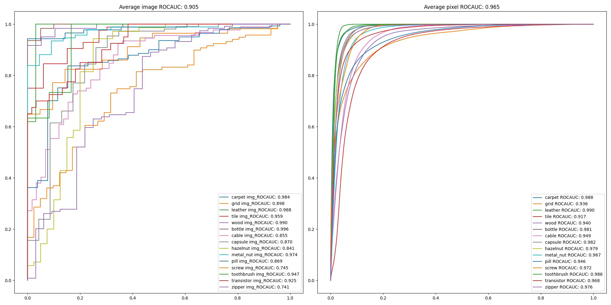

* Wide_ResNet50_2

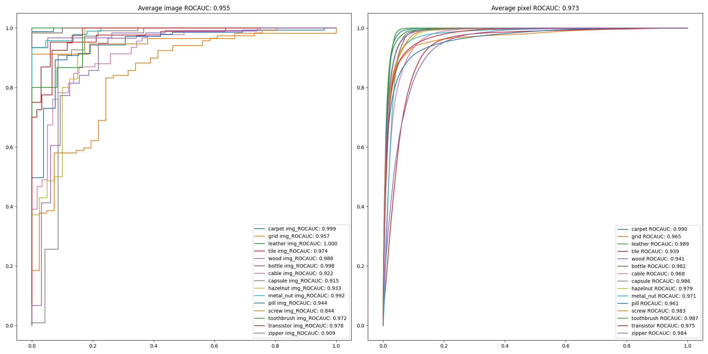

- Efficientnet-b7_fst

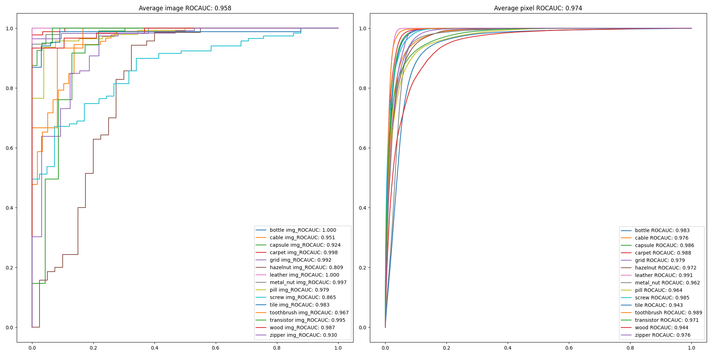

- Efficientnet-b7_md

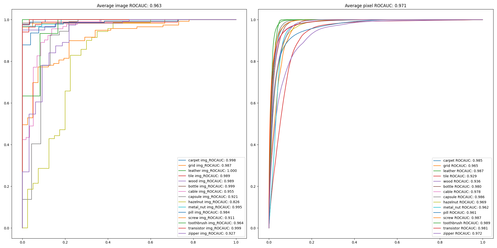

- Efficientnet-b7_lst

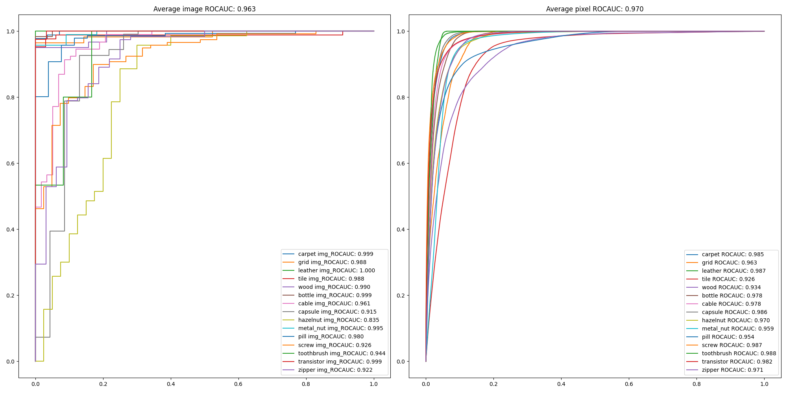

### Localization examples

- sampled by EfficientNet-B7

    

    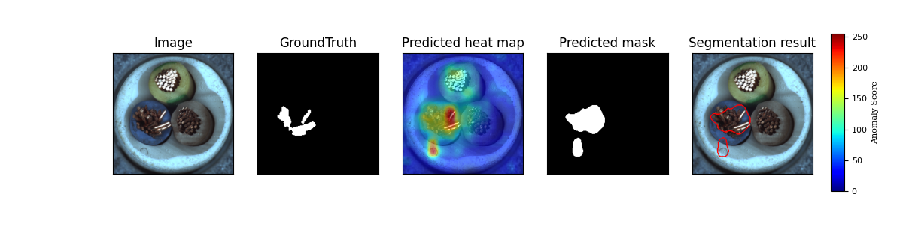

    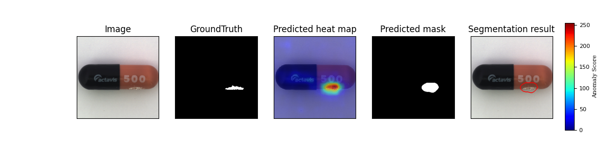

    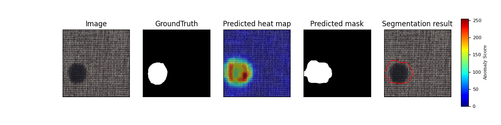

    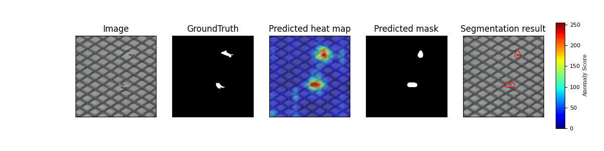

    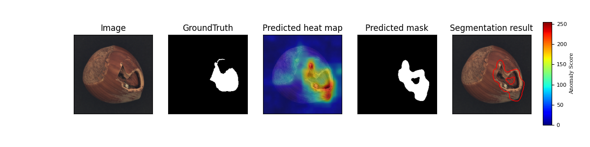

    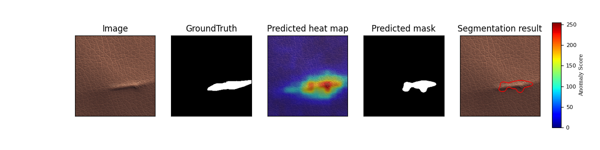

    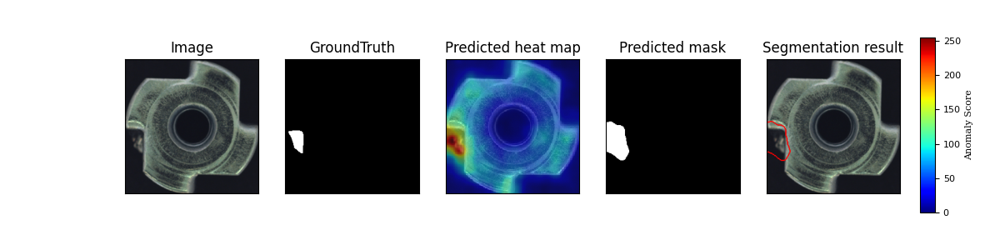

    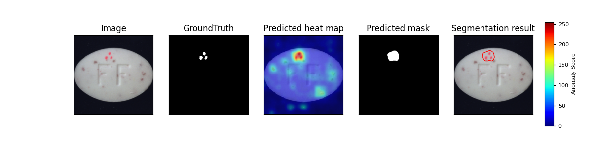

    

    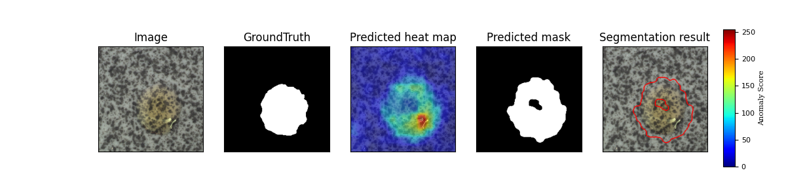

    

    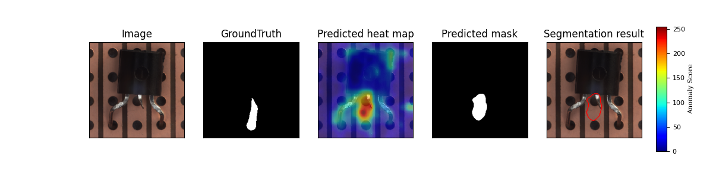

    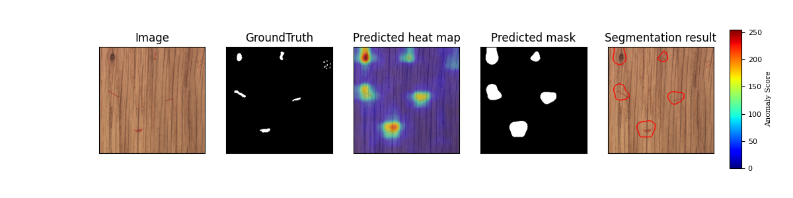

    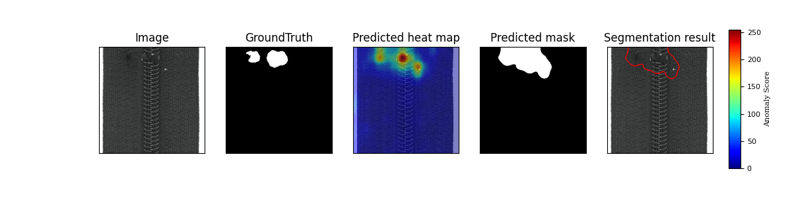

## Reference
[1] Thomas Defard, Aleksandr Setkov, Angelique Loesch, Romaric Audigier. *PaDiM: a Patch Distribution Modeling Framework for Anomaly Detection and Localization*. https://arxiv.org/pdf/2011.08785

[2] https://github.com/xiahaifeng1995/PaDiM-Anomaly-Detection-Localization-master
